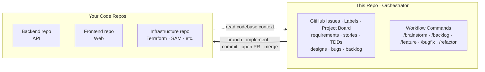
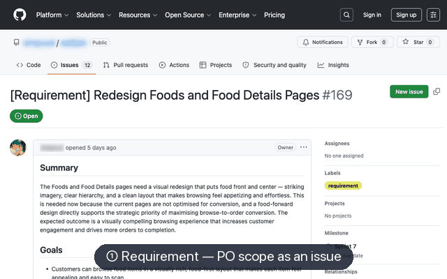
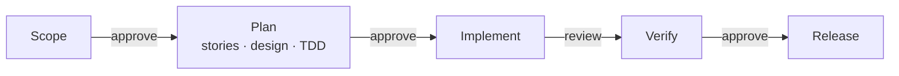

<div align="center">

# Sapiens-DTJ

**Sapiens Do The Job.**

**A GitHub-native, human-gated AI workflow for Claude Code — AI agents execute the work; sapiens gate every step: requirements, stories, designs, code review, release.**

[](LICENSE)
[](https://claude.com/claude-code)

</div>

---

## 🤔 Why This Exists

AI can 10x a team — but only if everyone uses it the same way. Without that, you get:

- **Inconsistent output.** Same feature, three architectures. Each team member prompts differently, gets different results. Productivity gains cancel out in review and rework.
- **Context scattered everywhere.** Requirements in Notion, designs in Figma, decisions in Slack, state in someone's head. AI can't read any of it. Humans waste time bridging tools.
- **No single source of truth.** When artifacts live across five platforms, nobody knows what's current. Work gets duplicated, decisions get reversed, context gets lost between sessions.

## 🧭 How It Works

- **Orchestrator, not a codebase.** Stories, sprints, designs, TDDs, and bugs live here as issues. Agents check out your real code repos (API, web, infra), registered once via `/setup`.
- **GitHub is the source of truth.** No Jira, no Notion — every artifact is an issue; lifecycle state lives on a GitHub Project board (Status field), not in chat.
- **Design lives in code, not Figma.** Mockups are Storybook surface stories committed to the frontend repo — built from your real components, reviewed as PRs, and read by implementation agents as the pixel-level reference. No design-tool drift: the mockup and the app share one component library.



<p align="center">
  
</p>

---

## 🚀 Quick Start

> **Prerequisites:** [Claude Code CLI](https://claude.com/claude-code) · [GitHub CLI (`gh`)](https://cli.github.com) · the code repo(s) you want agents to work on.

### 1. Get the workflow

**Option A — dedicated orchestrator repo (recommended).** Click **Use this template** → create your orchestrator repo (e.g. `myproduct-hub`) — its issues become your requirements, stories, and bugs. Clone it next to your code repos:

```bash
ls            # myproduct-api/  myproduct-web/
gh repo clone <you>/myproduct-hub
cd myproduct-hub && claude
```

**Option B — embed in an existing repo.** Copy `.claude/` into your project:

```bash
git clone https://github.com/simpscal/sapiens-dtj.git
cp -r sapiens-dtj/.claude /path/to/your/project/
```

### 2. Run setup

Inside Claude Code, run `/setup` and pick **All**. It generates:

| Artifact | Purpose |
|----------|---------|
| `.claude/skills/project-config/SKILL.md` | Registers codebases, detects tech stack, configures migration detection |
| `PRODUCT.md` | Captures vision, value proposition, business model, goals, strategic direction |
| GitHub labels | `requirement`, `user-story`, `bug`, etc. — safe to re-run |
| GitHub Project board | Status / Type / Sprint fields — the workflow's tracking surface; safe to re-run |

> [!TIP]
> Give every registered codebase its own `CLAUDE.md`. The implementation agents read it to learn each repo's build/test commands, folder structure, naming, and patterns — the richer it is, the more the generated code matches your conventions. Skip it and agents fall back to inference, which is slower and less faithful.

### 3. Kick off your first sprint

Each workflow has one natural-language entry command — just say what you want:

```
/feature "Next feature on the backlog"
```

`/feature`, `/bugfix`, and `/refactor` read your intent and run the right phase. To drive an entire workflow end-to-end (requirement → stories → design → TDD → implement) — auto-approving routine gates, clarifying the need with you up front, then pausing before pre-release — use `/auto`:

```
/auto "Next feature on the backlog"
```

> [!TIP]
> Not sure which workflow? Just describe the work to `/feature`, `/bugfix`, or `/refactor` — each routes to the right step. Or `/auto` to run it end-to-end.

> [!NOTE]
> Non-disruptive. Only `.claude/` and `PRODUCT.md` are added. Existing issues, PRs, and branches stay untouched.

---

## 🔄 Workflows

Five workflows, one shape: AI does the work, you approve at each gate — scope, plan, code review, release.

| Workflow | Entry | Covers |
|----------|-------|--------|
| [🆕 Feature](docs/workflows/feature.md) | `/feature` | Sprint cycle — requirement → stories → design → TDD → implement → release; plus in-sprint bugs & refactors that ride the sprint branch |
| [🐛 Bugfix](docs/workflows/bugfix.md) | `/bugfix` | Production bug lifecycle — report → fix → release via `main` |
| [🧹 Refactor](docs/workflows/refactor.md) | `/refactor` | Standalone tech-debt cleanup, no user-visible change — spec → implement → release via `main` |
| 💡 Brainstorm | `/brainstorm` | Collaborative ideation — riff features with you against PRODUCT.md, score on strategic fit, drop the keepers into the backlog as drafts |
| [🗂 Backlog](docs/workflows/backlog.md) | `/backlog` | Capture ideas, bugs, and refactors as drafts, then promote them into a workflow |

Every phase pauses for human review before the next begins:



Run `/auto` to flow through every phase automatically — it clarifies the need with you up front, then pauses before pre-release.

---

## ⚡ Commands

Say what you want — each workflow has one entry command that runs the right step:

| Command | What it does |
|---------|-------------|
| `/feature <text>` | Feature work — e.g. `start checkout revamp`, `write the stories`, `implement 42`, `fix bug in 42`, `refactor 42`, `ship sprint 3` |
| `/bugfix <text>` | Bug work — e.g. `login returns 500`, `fix 26`, `close 26` |
| `/refactor <text>` | Tech-debt — e.g. `tidy the payment module`, `implement 51` |
| `/brainstorm <text>` | Brainstorm feature ideas with you, score them, drop keepers into the backlog — e.g. `ideas to boost conversion` |
| `/backlog <text>` | Capture an idea or bug, or promote a draft into a workflow |
| `/auto <text>` | Run a whole workflow end-to-end; clarifies the need up front, then pauses before pre-release |
| `/setup` | One-off project setup — codebases, product doc, labels, board |

---

## 📋 Tracking Model

**Labels** classify what an issue is; the **GitHub Project board** tracks where it sits in the pipeline.

### 📦 Artifact Types (labels)

What the issue is. Set once on creation.

| | Label | Artifact |
|---|-------|---------|
|  | `requirement` | PO requirement, via `/feature` |
|  | `user-story` | Story, via `/feature` |
|  | `bug` | Bug, via `/bugfix`; source from title prefix (`[Bug]` production, `[Dev Bug]` development) |
|  | `refactoring` | Refactor, via `/refactor` |
|  | `requirement-updated` | Informational marker — requirement changed mid-sprint |

### 🔁 Board Status (Project field)

Where an item sits in the pipeline. Commands move it as work progresses.

| Status | Meaning | What happens next |
|--------|---------|------------------|
| `Backlog` | Captured draft via `/backlog` — not yet planned | `/backlog` |
| `Todo` | Issue filed, not started | `/feature` · `/bugfix` · `/refactor` |
| `In Progress` | Dev is currently implementing | — |
| `Implemented` | PRs open / merged to staging, awaiting verification | Human merges branch → sprint, or amend ACs then re-implement |
| `Done` | Released and closed | — |
