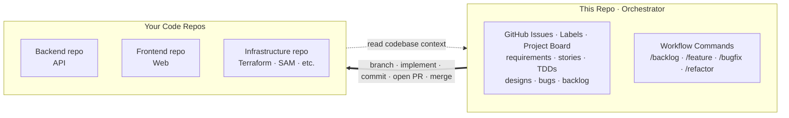
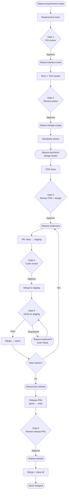
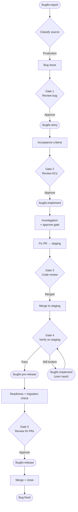
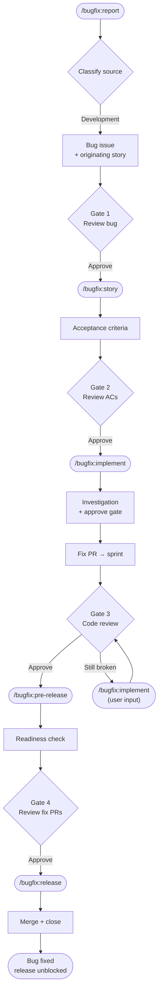
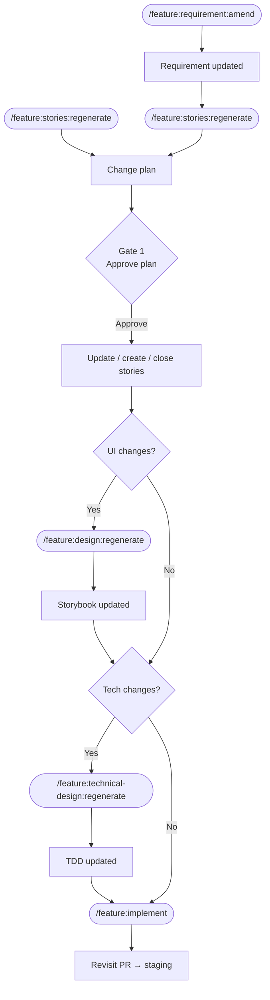
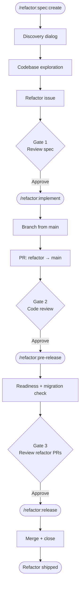

<div align="center">

# Sapiens-DTJ

**Sapiens Do The Job.**

**A GitHub-native, human-gated AI workflow for Claude Code — AI agents execute the work; sapiens gate every step: requirements, stories, designs, code review, release.**

[](LICENSE)
[](https://claude.com/claude-code)

</div>

---

## 🤔 Why This Exists

AI can 10x a team — but only if everyone uses it the same way. Without that, you get:

- **Inconsistent output.** Same feature, three architectures. Each team member prompts differently, gets different results. Productivity gains cancel out in review and rework.
- **Context scattered everywhere.** Requirements in Notion, designs in Figma, decisions in Slack, state in someone's head. AI can't read any of it. Humans waste time bridging tools.
- **No single source of truth.** When artifacts live across five platforms, nobody knows what's current. Work gets duplicated, decisions get reversed, context gets lost between sessions.

## 🧭 How It Works

- **Orchestrator, not a codebase.** Stories, sprints, designs, TDDs, and bugs live here as issues. Agents check out your real code repos (API, web, infra), registered once via `/setup`.
- **GitHub is the source of truth.** No Jira, no Notion — every artifact is an issue; lifecycle state lives on a GitHub Project board (Status field), not in chat.
- **Design lives in code, not Figma.** Mockups are Storybook surface stories committed to the frontend repo — built from your real components, reviewed as PRs, and read by implementation agents as the pixel-level reference. No design-tool drift: the mockup and the app share one component library.



<p align="center">
  
</p>

---

## 🚀 Quick Start

> **Prerequisites:** [Claude Code CLI](https://claude.com/claude-code) · [GitHub CLI (`gh`)](https://cli.github.com) · the code repo(s) you want agents to work on.

### 1. Get the workflow

**Option A — dedicated orchestrator repo (recommended).** Click **Use this template** → create your orchestrator repo (e.g. `myproduct-hub`) — its issues become your requirements, stories, and bugs. Clone it next to your code repos:

```bash
ls            # myproduct-api/  myproduct-web/
gh repo clone <you>/myproduct-hub
cd myproduct-hub && claude
```

**Option B — embed in an existing repo.** Copy `.claude/` into your project:

```bash
git clone https://github.com/simpscal/sapiens-dtj.git
cp -r sapiens-dtj/.claude /path/to/your/project/
```

### 2. Run setup

Inside Claude Code, run `/setup` and pick **All**. It generates:

| Artifact | Purpose |
|----------|---------|
| `.claude/skills/project-config/SKILL.md` | Registers codebases, detects tech stack, configures migration detection |
| `PRODUCT.md` | Captures vision, value proposition, business model, goals, strategic direction |
| GitHub labels | `requirement`, `user-story`, `bug`, etc. — safe to re-run |
| GitHub Project board | Status / Type / Sprint fields — the workflow's tracking surface; safe to re-run |

### 3. Kick off your first sprint

```
/feature:requirement:create "Next feature on the backlog"
```

> [!TIP]
> Not sure which command to run? `/help-flows` asks your intent and prints the exact command to copy-paste.

> [!NOTE]
> Non-disruptive. Only `.claude/` and `PRODUCT.md` are added. Existing issues, PRs, and branches stay untouched.

---

## 🔄 Workflows

<details>
<summary><strong>Feature Development</strong> — the standard sprint cycle</summary>

Story branches merge to **staging** for verification, then to the **sprint branch** on pass. Sprint branch stays clean.



</details>

<details>
<summary><strong>Bugfix (Production)</strong> — bugs found in production</summary>

Independent of sprint cycle. Fix PRs hit **staging** for verification, then `main`.



</details>

<details>
<summary><strong>Bugfix (Development)</strong> — bugs found during sprint work</summary>

Part of sprint cycle. Fix PRs target the **sprint branch**. Dev bugs block sprint release until closed.



</details>

<details>
<summary><strong>Upstream Change</strong> — requirement or story shifts mid-sprint</summary>

A change to an upstream artifact cascades downstream through stories, design, TDD, dev, and QA incrementally. Two entry points — a requirement-level scope shift or an AC-level story amendment — converge on the same regenerate-and-cascade path. All stages of `/feature` — no separate workflow.



**When to amend design and TDD:**

| Change type | Design | TDD |
|-------------|--------|-----|
| New UI surface or interaction | Yes | Maybe |
| Changed layout, component, or visual state | Yes | Maybe |
| New API endpoint or data model | No | Yes |
| Changed business logic or backend behaviour | No | Yes |
| UI + backend change together | Yes | Yes |
| Copy/label wording only | No | No |

</details>

<details>
<summary><strong>Refactoring</strong> — tech-debt and structural cleanup</summary>

No sprint, no separate verification stage. Branch from `main`, PR to `main`. DoD requires existing tests pass and no user-visible behavior change.



</details>

---

## ⚡ Commands

Each workflow is a set of **navigators**. Run the entry command — the navigator asks which mode (create / regenerate / etc.) and resolves arguments interactively.

### 🗂 `/backlog` — Pre-sprint capture

| Command | Run by | What it does |
|---------|--------|-------------|
| `/backlog:add [free text]` | Anyone | Quick-capture an idea, refactor, or production bug as a board draft (title + type + notes) — without touching the current sprint. |
| `/backlog:list` | Anyone | Show backlog drafts grouped by type (Feature / Refactor / Bug). |
| `/backlog:promote` | PO / Tech Lead | Promote a draft into its typed flow — feature requirement, refactor spec, or bug report — with full templates and approval gates; the draft is removed once the issue exists. |

### 🆕 `/feature` — Sprint feature lifecycle

| Command | Run by | What it does |
|---------|--------|-------------|
| `/feature:requirement` | PO | Create or amend a requirement. Create auto-provisions a board Sprint. |
| `/feature:stories` | BA | Decompose requirement into stories, or regenerate them after a scope delta (requirement change or user input). |
| `/feature:design` | Designer | Compose or regenerate per-surface Storybook stories via the ui-design agent (story change or user input). |
| `/feature:technical-design` | Tech Lead | Author or regenerate the sprint TDD (story change or user input). |
| `/feature:implement <story_issue>` | Dev | Implement one story — fresh or revisit (delta-only) based on prior implementation. |
| `/feature:pre-release <sprint_number>` | Release Mgr | Readiness gate, migration check, create release PRs (sprint → main), post sprint summary. |
| `/feature:release <sprint_number>` | Release Mgr | Merge release PRs, delete story branches, mark all sprint issues Done + close. |

### 🐛 `/bugfix` — Bug lifecycle (production and development)

| Command | Run by | What it does |
|---------|--------|-------------|
| `/bugfix:report [description]` | PO | Clarify bug interactively, classify source (production / development), open tracker issue. |
| `/bugfix:story <bug_issue>` | BA | Author Acceptance Criteria on the bug issue. |
| `/bugfix:implement <bug_issue>` | Dev | Investigate root cause (draft + approve gate), then fix — fresh or revisit. |
| `/bugfix:pre-release <bug_issue>` | Release Mgr | Readiness gate, migration check (production), post bug summary. |
| `/bugfix:release <bug_issue>` | Release Mgr | Merge bugfix PRs, mark Done on the board, close issue. |

> **Production bugs** branch from `main`, PR to `main`. **Development bugs** branch from the sprint branch, PR to the sprint branch, and block sprint release until closed.

### 🧹 `/refactor` — Tech-debt and structural cleanup

| Command | Run by | What it does |
|---------|--------|-------------|
| `/refactor:spec` | Tech Lead | Create or amend a refactor spec (draft + approve gate). |
| `/refactor:implement <refactor_issue>` | Dev | Implement the spec — preserves observable behaviour. |
| `/refactor:pre-release <refactor_issue>` | Release Mgr | Readiness gate, migration check, post summary. |
| `/refactor:release <refactor_issue>` | Release Mgr | Merge refactor PRs, close issue. |

### 🛠 `/setup` — One-off setup

| Command | What it does |
|---------|-------------|
| `/setup` | Pick **All** (full setup) or individual: project-config, labels, board, product. |

### 🧭 `/help-flows` — Workflow picker

| Command | What it does |
|---------|-------------|
| `/help-flows` | Asks intent, prints exact next command to copy-paste. |
| `/help-flows <intent>` | Free-text intent (e.g. `i want to fix a bug`); resolves to one command. |
| `/help-flows all` | Prints full cheat sheet of every stage. |

---

## 📋 Tracking Model

**Labels** classify what an issue is; the **GitHub Project board** tracks where it sits in the pipeline.

### 📦 Artifact Types (labels)

What the issue is. Set once on creation.

| | Label | Artifact |
|---|-------|---------|
|  | `requirement` | PO requirement created via `/feature:requirement:create` |
|  | `user-story` | Story created via `/feature:stories` |
|  | `bug` | Bug reported via `/bugfix:report`; source from title prefix (`[Bug]` production, `[Dev Bug]` development) |
|  | `refactoring` | Refactor spec created via `/refactor:spec:create` |
|  | `requirement-updated` | Informational marker — requirement changed mid-sprint; follow with `/feature:stories:regenerate` |

### 🔁 Board Status (Project field)

Where an item sits in the pipeline. Commands move it as work progresses.

| Status | Meaning | What happens next |
|--------|---------|------------------|
| `Backlog` | Captured draft via `/backlog:add` — not yet planned | `/backlog:promote` |
| `Todo` | Issue filed, not started | implement command |
| `In Progress` | Dev is currently implementing | — |
| `Implemented` | PRs open / merged to staging, awaiting verification | Human merges branch → sprint, or amend ACs then re-implement |
| `Done` | Released and closed | — |
