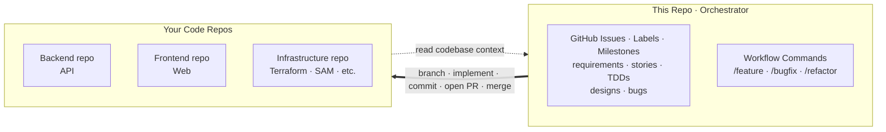
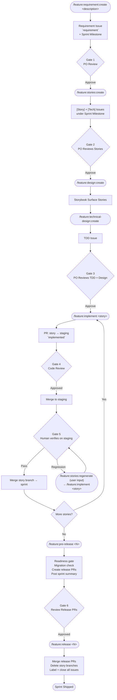
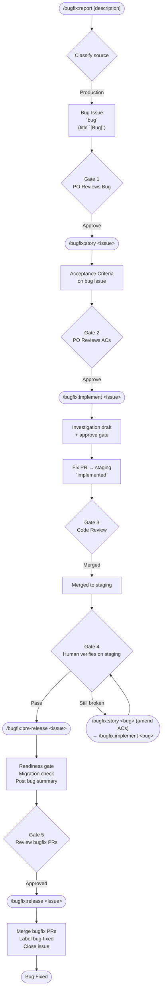
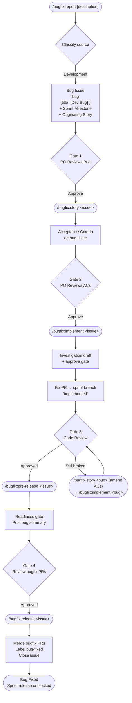
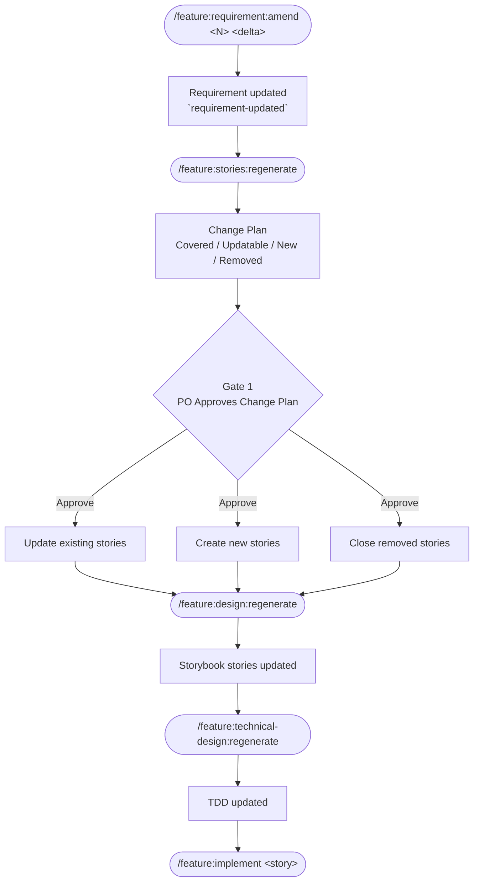
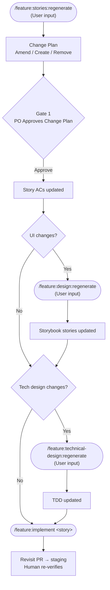
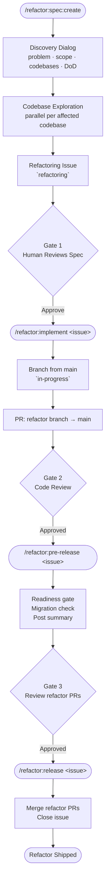

<div align="center">

# Sapiens-DTJ

**Sapiens Do The Job.**

**A GitHub-native, human-gated AI workflow for Claude Code — AI agents execute the work; sapiens gate every step: requirements, stories, designs, code review, release.**

[](LICENSE)
[](https://claude.com/claude-code)

</div>

---

## 🤔 Why This Exists

AI can 10x a team — but only if everyone uses it the same way. Without that, you get:

- **Inconsistent output.** Same feature, three architectures. Each team member prompts differently, gets different results. Productivity gains cancel out in review and rework.
- **Context scattered everywhere.** Requirements in Notion, designs in Figma, decisions in Slack, state in someone's head. AI can't read any of it. Humans waste time bridging tools.
- **No single source of truth.** When artifacts live across five platforms, nobody knows what's current. Work gets duplicated, decisions get reversed, context gets lost between sessions.

## 🧭 How It Works

- **Orchestrator, not a codebase.** Stories, sprints, designs, TDDs, and bugs live here as issues. Agents check out your real code repos (API, web, infra), registered once via `/setup`.
- **GitHub is the source of truth.** No Jira, no Notion — every artifact is an issue; state changes by label, not chat.
- **Design lives in code, not Figma.** Mockups are Storybook surface stories committed to the frontend repo — built from your real components, reviewed as PRs, and read by implementation agents as the pixel-level reference. No design-tool drift: the mockup and the app share one component library.



<p align="center">
  
</p>

---

## 🚀 Quick Start

**Prerequisites:** Claude Code CLI, GitHub CLI (`gh`), and the code repo(s) you want agents to work on.

**Option A — dedicated orchestrator repo (recommended):**

1. Click **Use this template** → create your orchestrator repo (e.g. `myproduct-hub`). Its issues become your requirements, stories, and bugs.
2. Clone it next to your code repos:

```bash
ls            # myproduct-api/  myproduct-web/
gh repo clone <you>/myproduct-hub
cd myproduct-hub && claude
```

**Option B — embed in an existing repo:**

```bash
git clone https://github.com/simpscal/sapiens-dtj.git
cp -r sapiens-dtj/.claude /path/to/your/project/
```

Either way, run `/setup` (pick **All**) to:

- Generate `.claude/skills/project-config/SKILL.md` — registers codebases, detects tech stack, configures migration detection.
- Generate `PRODUCT.md` — captures vision, value proposition, business model, goals, and strategic direction.
- Create GitHub labels (`requirement`, `user-story`, `bug`, etc.). Safe to re-run.

Then kick off a sprint:

```
/feature:requirement:create "Next feature on the backlog"
```

> [!TIP]
> Not sure which command to run? Use `/help-flows` — it asks your intent and prints the exact command to copy-paste.

> [!NOTE]
> Non-disruptive. Only `.claude/` and `PRODUCT.md` are added. Existing issues, PRs, and branches stay untouched.

---

## ⚡ Commands

Each workflow is a set of **navigators**. Run the entry command — the navigator asks which mode (create / regenerate / etc.) and resolves arguments interactively.

### 🆕 `/feature` — Sprint feature lifecycle

| Command | Run by | What it does |
|---------|--------|-------------|
| `/feature:requirement` | PO | Create or amend a requirement. Create auto-provisions a sprint milestone. |
| `/feature:stories` | BA | Decompose requirement into stories, or regenerate them after a scope delta (requirement change or user input). |
| `/feature:design` | Designer | Compose or regenerate per-surface Storybook stories via the ui-design agent (story change or user input). |
| `/feature:technical-design` | Tech Lead | Author or regenerate the sprint TDD (story change or user input). |
| `/feature:implement <story_issue>` | Dev | Implement one story — fresh or revisit (delta-only) based on prior implementation. |
| `/feature:pre-release <sprint_number>` | Release Mgr | Readiness gate, migration check, create release PRs (sprint → main), post sprint summary. |
| `/feature:release <sprint_number>` | Release Mgr | Merge release PRs, delete story branches, label + close all sprint issues. |

### 🐛 `/bugfix` — Bug lifecycle (production and development)

| Command | Run by | What it does |
|---------|--------|-------------|
| `/bugfix:report [description]` | PO | Clarify bug interactively, classify source (production / development), open tracker issue. |
| `/bugfix:story <bug_issue>` | BA | Author Acceptance Criteria on the bug issue. |
| `/bugfix:implement <bug_issue>` | Dev | Investigate root cause (draft + approve gate), then fix — fresh or revisit. |
| `/bugfix:pre-release <bug_issue>` | Release Mgr | Readiness gate, migration check (production), post bug summary. |
| `/bugfix:release <bug_issue>` | Release Mgr | Merge bugfix PRs, label `bug-fixed`, close issue. |

> **Production bugs** branch from `main`, PR to `main`. **Development bugs** branch from the sprint branch, PR to the sprint branch, and block sprint release until closed.

### 🧹 `/refactor` — Tech-debt and structural cleanup

| Command | Run by | What it does |
|---------|--------|-------------|
| `/refactor:spec` | Tech Lead | Create or amend a refactor spec (draft + approve gate). |
| `/refactor:implement <refactor_issue>` | Dev | Implement the spec — preserves observable behaviour. |
| `/refactor:pre-release <refactor_issue>` | Release Mgr | Readiness gate, migration check, post summary. |
| `/refactor:release <refactor_issue>` | Release Mgr | Merge refactor PRs, close issue. |

### 🛠 `/setup` — One-off setup

| Command | What it does |
|---------|-------------|
| `/setup` | Pick **All** (full setup) or individual: project-config, labels, product. |

### 🧭 `/help-flows` — Workflow picker

| Command | What it does |
|---------|-------------|
| `/help-flows` | Asks intent, prints exact next command to copy-paste. |
| `/help-flows <intent>` | Free-text intent (e.g. `i want to fix a bug`); resolves to one command. |
| `/help-flows all` | Prints full cheat sheet of every stage. |

---

## 🔄 Workflows

<details>
<summary><strong>Feature Development</strong> — the standard sprint cycle</summary>

Story branches merge to **staging** for verification, then to the **sprint branch** on pass. Sprint branch stays clean.



</details>

<details>
<summary><strong>Bugfix (Production)</strong> — bugs found in production</summary>

Independent of sprint cycle. Fix PRs hit **staging** for verification, then `main`.



</details>

<details>
<summary><strong>Bugfix (Development)</strong> — bugs found during sprint work</summary>

Part of sprint cycle. Fix PRs target the **sprint branch**. Dev bugs block sprint release until closed.



</details>

<details>
<summary><strong>Requirements Change</strong> — scope shifts mid-sprint</summary>

Cascades through stories, design, TDD, dev, and QA incrementally. All stages of `/feature` — no separate workflow.



</details>

<details>
<summary><strong>Story Change</strong> — AC-level amendments</summary>

AC adjustments to one or more stories — not the full requirement. Runs `/feature:stories:regenerate` with the **User input** source.



**When to amend design and TDD:**

| Change type | Design | TDD |
|-------------|--------|-----|
| New UI surface or interaction | Yes | Maybe |
| Changed layout, component, or visual state | Yes | Maybe |
| New API endpoint or data model | No | Yes |
| Changed business logic or backend behaviour | No | Yes |
| UI + backend change together | Yes | Yes |
| Copy/label wording only | No | No |

</details>

<details>
<summary><strong>Refactoring</strong> — tech-debt and structural cleanup</summary>

No sprint, no separate verification stage. Branch from `main`, PR to `main`. DoD requires existing tests pass and no user-visible behavior change.



</details>

---

## 🏷️ Labels

Two purposes: **artifact type** and **lifecycle state**.

### 📦 Artifact Types

What the issue is. Set once on creation.

| | Label | Artifact |
|---|-------|---------|
|  | `requirement` | PO requirement created via `/feature:requirement:create` |
|  | `user-story` | Story created via `/feature:stories` |
|  | `bug` | Bug reported via `/bugfix:report`; source from title prefix (`[Bug]` production, `[Dev Bug]` development) |
|  | `refactoring` | Refactor spec created via `/refactor:spec:create` |

### 🔁 Lifecycle States

Where a story or bug sits in the pipeline. Change as work progresses; tell agents what's next.

| | Label | Meaning | What happens next |
|---|-------|---------|------------------|
|  | `in-progress` | Dev is currently implementing | — |
|  | `implemented` | PR merged to staging, awaiting verification | Human merges branch → sprint, or amend ACs then re-implement |
|  | `requirement-updated` | Requirement changed mid-sprint | `/feature:stories:regenerate` |
|  | `sprint-completed` | Sprint closed by release command | — |
|  | `bug-fixed` | Bug closed after `/bugfix:release` | — |
