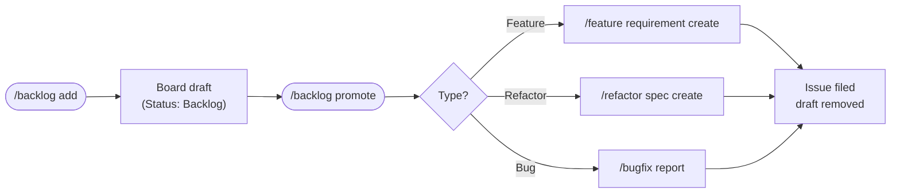

# 🗂 Backlog Workflow

Pre-sprint capture. Quick-grab ideas, refactors, and production bugs as board drafts without touching the current sprint, then promote them into a full workflow when ready.

## Phases

| Command | Run by | What it does |
|---------|--------|-------------|
| `/backlog add [free text]` | Anyone | Quick-capture an idea, refactor, or production bug as a board draft (title + type + notes) — without touching the current sprint. |
| `/backlog list` | Anyone | Show backlog drafts grouped by type (Feature / Refactor / Bug). |
| `/backlog promote` | PO / Tech Lead | Promote a draft into its typed flow — feature requirement, refactor spec, or bug report — with full templates and approval gates; the draft is removed once the issue exists. |
