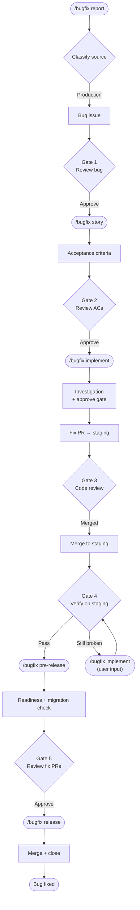

# 🐛 Bugfix Workflow

Production bug lifecycle.

## Flow

## Phases

| Command | Run by | What it does |
|---------|--------|-------------|
| `/bugfix report [description]` | PO | Clarify bug interactively, open the production bug issue. |
| `/bugfix story <bug_issue>` | BA | Author Acceptance Criteria on the bug issue. |
| `/bugfix implement <bug_issue>` | Dev | Investigate root cause (draft + approve gate), then fix — fresh or revisit. |
| `/bugfix pre-release <bug_issue>` | Release Mgr | Readiness gate, migration check (production), post bug summary. |
| `/bugfix release <bug_issue>` | Release Mgr | Merge bugfix PRs, mark Done on the board, close issue. |
