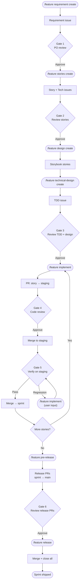
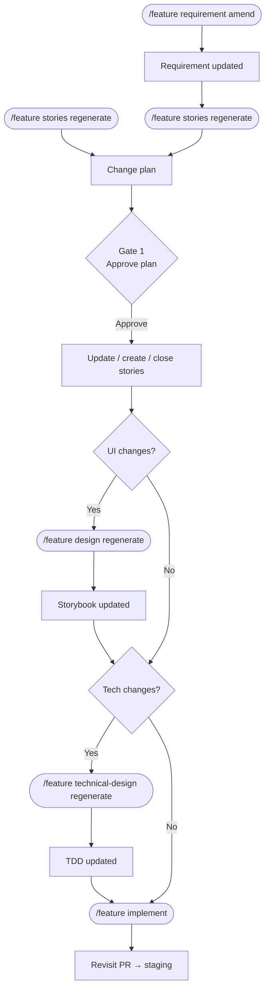
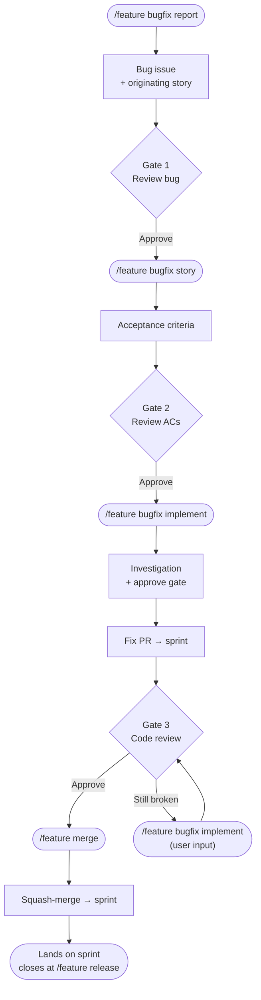
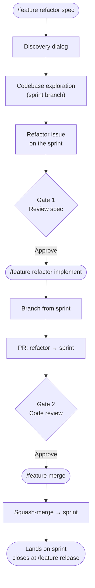

# 🆕 Feature Workflow

Story branches merge to **staging** for verification, then to the **sprint branch** on pass. Sprint branch stays clean.

## Phases

| Command | Run by | What it does |
|---------|--------|-------------|
| `/feature requirement` | PO | Create or amend a requirement. Create auto-provisions a board Sprint. |
| `/feature stories` | BA | Decompose requirement into stories, or regenerate them after a scope delta (requirement change or user input). |
| `/feature design` | Designer | Compose or regenerate per-surface Storybook stories via the ui-design agent (story change or user input). |
| `/feature technical-design` | Tech Lead | Author or regenerate the sprint TDD (story change or user input). |
| `/feature implement <story_issue>` | Dev | Implement one story — fresh or revisit (delta-only) based on prior implementation. |
| `/feature pre-release <sprint_number>` | Release Mgr | Readiness gate, migration check, create release PRs (sprint → main), post sprint summary. |
| `/feature release <sprint_number>` | Release Mgr | Merge release PRs, delete story branches, mark all sprint issues Done + close. |

## Mid-sprint changes

A change to an upstream artifact cascades downstream through stories, design, TDD, dev, and QA incrementally.

**When to amend design and TDD:**

| Change type | Design | TDD |
|-------------|--------|-----|
| New UI surface or interaction | Yes | Maybe |
| Changed layout, component, or visual state | Yes | Maybe |
| New API endpoint or data model | No | Yes |
| Changed business logic or backend behaviour | No | Yes |
| UI + backend change together | Yes | Yes |
| Copy/label wording only | No | No |

## In-sprint bugs & refactors

Bugs surfaced and refactors needed *during* a sprint ride the **sprint branch** alongside stories.

### 🐛 In-sprint bugs

A bug found while building the sprint.

| Command | Run by | What it does |
|---------|--------|-------------|
| `/feature bugfix report [description]` | PO | Clarify the bug interactively, resolve the originating story, open the dev bug issue on the sprint. |
| `/feature bugfix story <bug_issue>` | BA | Author Acceptance Criteria on the bug issue. |
| `/feature bugfix implement <bug_issue>` | Dev | Investigate root cause (draft + approve gate), then fix on the sprint branch — fresh or revisit. |
| `/feature merge <bug_issue>` | Dev | Squash-merge the reviewed fix PRs into the sprint branch. |

### 🧹 In-sprint refactors

Tech-debt cleanup scoped to the sprint, no user-visible behavior change.

| Command | Run by | What it does |
|---------|--------|-------------|
| `/feature refactor spec [description]` | Tech Lead | Draft an in-sprint refactor spec — discovery, sprint-branch exploration, draft + approve gate, file on the sprint. Create-only (no amend). |
| `/feature refactor implement <refactor_issue>` | Dev | Implement the spec on the sprint branch — preserves observable behaviour. |
| `/feature merge <refactor_issue>` | Dev | Squash-merge the reviewed refactor PRs into the sprint branch. |
