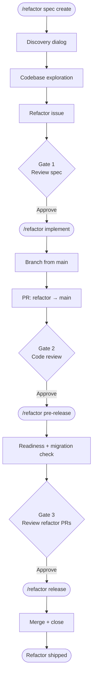

# 🧹 Refactor Workflow

Tech-debt and structural cleanup, no user-visible behavior change.

## Flow

## Phases

| Command | Run by | What it does |
|---------|--------|-------------|
| `/refactor spec` | Tech Lead | Create or amend a refactor spec (draft + approve gate). |
| `/refactor implement <refactor_issue>` | Dev | Implement the spec — preserves observable behaviour. |
| `/refactor pre-release <refactor_issue>` | Release Mgr | Readiness gate, migration check, post summary. |
| `/refactor release <refactor_issue>` | Release Mgr | Merge refactor PRs, close issue. |
